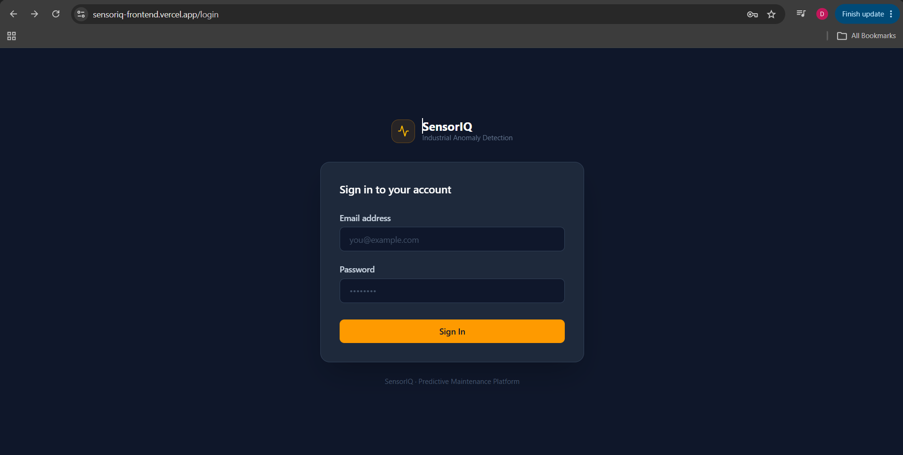
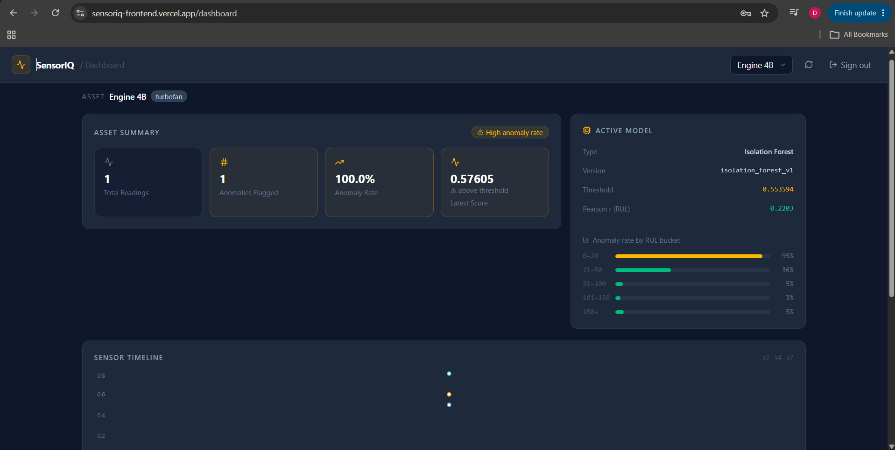
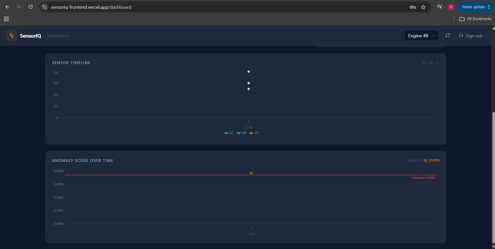

<div align="center">

# SensorIQ — Industrial IoT Anomaly Detection Platform

**Unsupervised machine learning for predictive maintenance of turbofan engines**

[](https://python.org)
[](https://fastapi.tiangolo.com)
[](https://pytorch.org)
[](https://react.dev)
[](https://supabase.com)

</div>

---

## Live Demo

| | Link |
|---|---|
| **Frontend** | https://sensoriq-frontend.vercel.app |
| **API Docs** | https://sensoriq.onrender.com/docs |
| **GitHub** | https://github.com/DharshanKumar1010/SensorIQ |

---

## Screenshots


*Login page*


*Dashboard with anomaly summary and model info*


*Sensor timeline and anomaly score chart*

---

## Overview

SensorIQ detects abnormal sensor behaviour in industrial equipment **without requiring any labeled failure data** — a key constraint in real-world predictive maintenance. The system trains exclusively on healthy engine cycles, learns what normal operation looks like, and flags windows where sensor readings deviate significantly from that baseline. Two models are compared side-by-side: an Isolation Forest baseline and an LSTM Autoencoder that reconstructs sensor sequences and scores anomalies by reconstruction error. Both models confirm the same finding: reconstruction error rises steadily as remaining useful life (RUL) decreases, demonstrating that the system tracks degradation purely from raw sensor signals.

---

## Key Features

- **Isolation Forest baseline** — F1: 0.575, 95% detection rate on near-failure windows (RUL < 20)
- **LSTM Autoencoder** — PyTorch seq2seq model (`hidden_size=128`, `dropout=0.2`, up to 200 epochs with early stopping); mean reconstruction error 31% higher for RUL 0–20 windows vs healthy windows
- **Degradation tracking** — Pearson correlation between reconstruction error and RUL: **r = −0.2203** (error rises as engine approaches failure)
- **Real-time scoring API** — FastAPI endpoint ingests sensor batches, scores every reading in the same transaction, stores results in Supabase
- **React dashboard** — sensor timeline (s2/s4/s7), anomaly score chart with threshold line, per-asset anomaly rate, model metadata
- **MLflow experiment tracking** — all training runs, hyperparameters, and evaluation metrics versioned and reproducible
- **Model comparison pipeline** — `ml/compare_models.py` evaluates both models on the same test set and saves side-by-side plots and a machine-readable `eval_summary.json`

---

## Tech Stack

| Layer | Technology |
|---|---|
| **Backend API** | FastAPI, SQLAlchemy 2.0 (async), Alembic, Pydantic v2 |
| **ML** | PyTorch, scikit-learn, MLflow, NumPy, pandas, Matplotlib |
| **Frontend** | React 19, Vite, TypeScript, Tailwind CSS v4, Recharts |
| **Database** | Supabase (PostgreSQL) via asyncpg |
| **Deploy** | Render (API), Vercel (frontend) |
| **Auth** | JWT (python-jose), bcrypt password hashing |

---

## Architecture

```
 NASA C-MAPSS FD001        ETL Pipeline             ML Training
 ┌──────────────────┐     ┌──────────────┐     ┌──────────────────────┐
 │ train_FD001.txt  │────▶│ preprocess.py│────▶│  Isolation Forest    │
 │ test_FD001.txt   │     │              │  ┌──▶│  (scikit-learn)      │
 │ RUL_FD001.txt    │     │ • RUL labels │  │  └──────────────────────┘
 │                  │     │ • min-max    │  │  ┌──────────────────────┐
 │ 100 engines      │     │   scaling    │──┘  │  LSTM Autoencoder    │
 │ 21 sensors       │     │ • windows    │────▶│  (PyTorch, h=128)    │
 │ 20,631 cycles    │     │   (30×1)     │     │  MSE recon. error    │
 └──────────────────┘     └──────────────┘     └──────────┬───────────┘
                                                           │
                                                  ml/artifacts/
                                          autoencoder.pt · isolation_forest.pkl
                                          scaler_params.npy · train_errors.npy
                                                           │
                          ┌────────────────────────────────▼──────────────────────┐
                          │                    FastAPI Backend                      │
                          │                                                         │
                          │  POST /ingest/{asset_id}   → score → anomaly_scores   │
                          │  GET  /anomalies/{asset_id} → flagged readings         │
                          │  GET  /anomalies/{asset_id}/model-info → eval stats    │
                          └──────────────┬──────────────────────────┬──────────────┘
                                         │                          │
                          ┌──────────────▼──────────┐  ┌───────────▼─────────────┐
                          │   Supabase (PostgreSQL)  │  │    React Dashboard      │
                          │                          │  │                         │
                          │  users                   │  │  LoginPage              │
                          │  assets                  │  │  DashboardPage          │
                          │  readings                │  │  SensorTimelineChart    │
                          │  anomaly_scores          │  │  AnomalyFlagsChart      │
                          └──────────────────────────┘  └─────────────────────────┘
```

---

## Dataset — NASA C-MAPSS FD001

| Property | Value |
|---|---|
| Source | [NASA Prognostics Center of Excellence](https://www.nasa.gov/intelligent-systems-division/discovery-and-systems-health/pcoe/pcoe-data-set-repository/) |
| Subset | FD001 (single operating condition, single fault mode) |
| Training engines | 100 |
| Test engines | 100 |
| Sensors | 21 per cycle |
| Training cycles | 20,631 |
| Healthy threshold | RUL > 50 cycles |
| Near-failure threshold | RUL < 20 cycles |
| Window size | 30 cycles (stride = 1) |

Healthy windows (RUL > 50) are used exclusively for training — **no failure events required**.

---

## ML Approach

### The core idea

Real industrial datasets almost never have labeled failure events. Labeling requires an engine to actually fail — expensive, rare, and dangerous. SensorIQ sidesteps this entirely by defining the problem differently: **learn what healthy looks like, then score deviations**.

### Isolation Forest (baseline)

Isolation Forest isolates anomalies by randomly partitioning the feature space — anomalous points are isolated in fewer splits. Trained on flattened healthy windows (shape `630 = 30 × 21`), it assigns a continuous anomaly score to each test window.

**Result:** F1 = 0.575 on near-failure windows; Pearson r (RUL vs score) = −0.2203.

### LSTM Autoencoder (core model)

The autoencoder learns to compress a 30-cycle sensor window into a latent vector and reconstruct it. Trained only on healthy data, it reconstructs healthy windows accurately. Anomalous windows (engine degradation) produce high mean squared error because the model was never trained to reconstruct them.

```
Input (30×21) ──▶ Encoder LSTM ──▶ Latent vector ──▶ Decoder LSTM ──▶ Reconstruction (30×21)
                  h=128, 2 layers                    h=128, 2 layers
                                           │
                                    Anomaly score = MSE(input, reconstruction)
```

**Training config:** 200 epochs max, early stopping patience = 15, 90/10 train/val split, LR = 0.0005, dropout = 0.2.

**Result:** Mean error for RUL 0–20 = **0.00715** vs RUL 51–100 = **0.00545** (+31%). The model identifies near-failure engines with no knowledge of when or how they failed.

### Threshold

The anomaly threshold is the **95th percentile of training reconstruction errors** — entirely label-free. Current value: `0.005618`.

---

## API Endpoints

| Method | Path | Description |
|---|---|---|
| `POST` | `/auth/register` | Register a new user |
| `POST` | `/auth/login` | Login, returns JWT |
| `GET` | `/auth/me` | Current authenticated user |
| `GET` | `/assets` | List user's monitored assets |
| `POST` | `/assets` | Create a new asset |
| `POST` | `/ingest/{asset_id}` | Ingest a batch of sensor readings and score them |
| `GET` | `/anomalies/{asset_id}` | Scored readings with anomaly flags |
| `GET` | `/anomalies/{asset_id}/summary` | Anomaly rate, total count, recent alerts |
| `GET` | `/anomalies/{asset_id}/model-info` | Active model version, threshold, RUL bucket stats |
| `GET` | `/health` | Health check |

Full interactive docs at **https://sensoriq.onrender.com/docs**.

---

## Local Setup

**Prerequisites:** Python 3.10+, Node.js 18+, a [Supabase](https://supabase.com) project, NASA C-MAPSS FD001 files in `data/raw/cmapss/`.

```bash
# 1. Clone
git clone https://github.com/DharshanKumar1010/SensorIQ.git
cd SensorIQ

# 2. Python environment
python -m venv venv
venv\Scripts\activate          # Windows
# source venv/bin/activate     # macOS / Linux

pip install -r requirements.txt

# 3. Environment variables — copy the template and fill in your values
cp .env.example .env           # edit DATABASE_URL, SECRET_KEY

# 4. Run database migrations
alembic upgrade head

# 5. Train the ML models
python -m ml.preprocess
python -m ml.train_isolation
python -m ml.train_autoencoder   # requires PyTorch
python -m ml.compare_models      # generates eval_summary.json

# 6. Start the API
uvicorn app.main:app --reload
# → http://localhost:8000/docs

# 7. Start the frontend (separate terminal)
cd frontend
npm install
npm run dev
# → http://localhost:5173
```

---

## Project Structure

```
SensorIQ/
├── app/                          # FastAPI application
│   ├── main.py                   # App entry point, CORS, OpenAPI schema
│   ├── config.py                 # Pydantic-settings (reads .env)
│   ├── database.py               # Async SQLAlchemy engine + session
│   ├── models/
│   │   ├── sensor.py             # Asset, Reading, AnomalyScore ORM models
│   │   └── user.py               # User ORM model
│   ├── schemas/
│   │   ├── sensor.py             # Pydantic request/response schemas
│   │   └── auth.py               # Auth schemas
│   ├── routers/
│   │   ├── auth.py               # /auth/register, /login, /me
│   │   ├── assets.py             # /assets CRUD
│   │   ├── ingest.py             # /ingest — batch telemetry + scoring
│   │   └── anomalies.py          # /anomalies — scored readings + model-info
│   └── services/
│       ├── anomaly.py            # Model loader, score dispatcher (IF / AE)
│       └── auth.py               # JWT encode/decode, get_current_user
│
├── ml/                           # Machine learning pipeline
│   ├── model.py                  # LSTMAutoencoder architecture (shared)
│   ├── preprocess.py             # C-MAPSS ETL → windowed numpy arrays
│   ├── train_isolation.py        # Isolation Forest training + MLflow
│   ├── train_autoencoder.py      # LSTM Autoencoder training + MLflow
│   ├── evaluate.py               # Isolation Forest PR-curve evaluation
│   ├── evaluate_autoencoder.py   # Autoencoder RUL-bucket + degradation plots
│   ├── compare_models.py         # Side-by-side comparison → eval_summary.json
│   └── artifacts/                # Trained model files (committed to repo)
│       ├── autoencoder.pt
│       ├── isolation_forest.pkl
│       ├── train_errors.npy
│       └── scaler_params.npy
│
├── frontend/                     # React + Vite + TypeScript dashboard
│   └── src/
│       ├── api.ts                # Typed axios client for all endpoints
│       ├── App.tsx               # Router (login / dashboard)
│       ├── pages/
│       │   ├── LoginPage.tsx
│       │   └── DashboardPage.tsx
│       └── components/
│           ├── AssetSelector.tsx
│           ├── SensorTimelineChart.tsx
│           ├── AnomalyFlagsChart.tsx
│           ├── AnomalySummaryCard.tsx
│           └── ModelInfoCard.tsx
│
├── alembic/                      # Database migrations
├── data/
│   ├── raw/cmapss/               # NASA C-MAPSS source files (gitignored)
│   └── processed/                # Windowed numpy arrays (gitignored)
├── docs/screenshots/             # README screenshots
├── render.yaml                   # Render deployment config
├── requirements.txt
└── CLAUDE.md                     # Project context and conventions
```

---

## Portfolio Context

This project demonstrates an end-to-end MLOps pipeline built for the following interview contexts:

| Company | Framing |
|---|---|
| **GE Aerospace** | Reconstruction-error anomaly scoring on turbofan sensor streams using NASA C-MAPSS, the same dataset used in GE's PHM challenge |
| **Ather Energy** | Unsupervised detection of abnormal motor/battery sensor patterns before EV component failure — no labeled failure events required |
| **IBM** | End-to-end MLOps: data ingestion → unsupervised training → MLflow versioning → FastAPI serving → React dashboard |

---

<div align="center">
Built by <a href="https://github.com/DharshanKumar1010">Dharshan Kumar</a>
</div>
